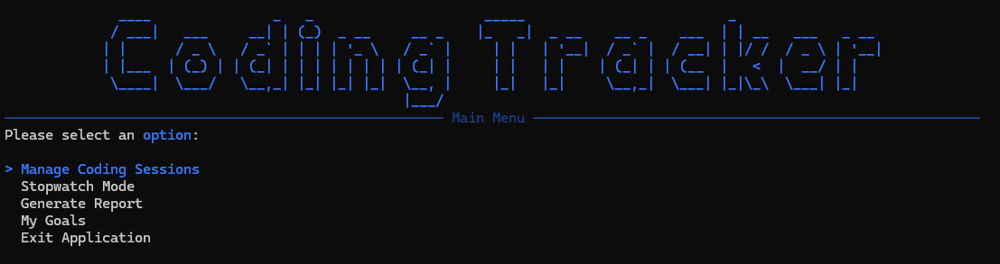
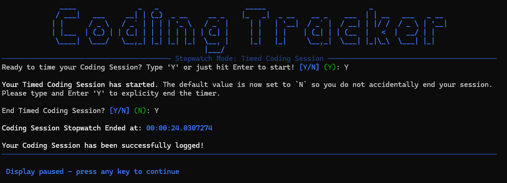
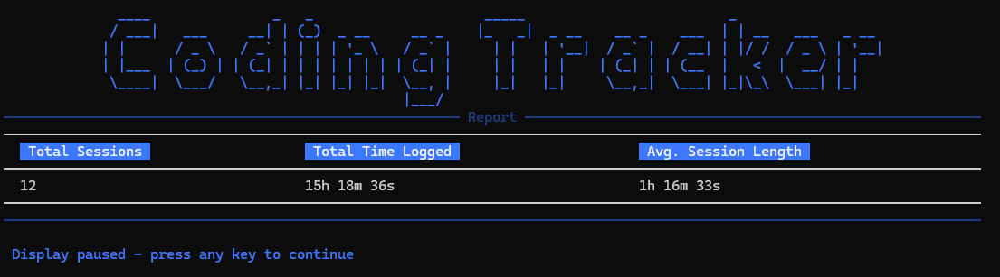
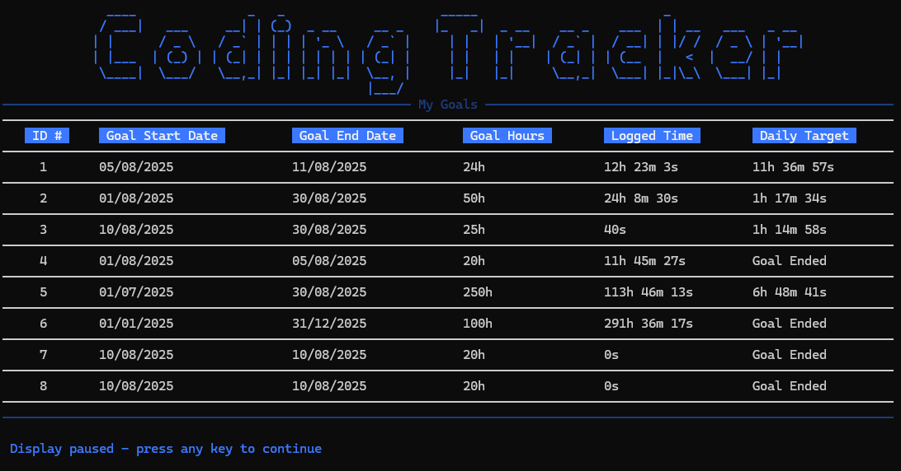

# Coding Tracker

[The Coding Tracker Project](https://thecsharpacademy.com/project/13/coding-tracker) is a CSharpAcademy roadmap project that introduces you to DTO via Dapper and parsing DateTime's. 

Developed with C#, Dapper, Spectre Console and SQLite.

# Requirements:
- :white_check_mark: This application has the same requirements as the previous project, except that now you'll be logging your daily coding time.

- :white_check_mark: To show the data on the console, you should use the "Spectre.Console" library.

- :white_check_mark: You're required to have separate classes in different files (ex. UserInput.cs, Validation.cs, CodingController.cs)

- :white_check_mark: You should tell the user the specific format you want the date and time to be logged and not allow any other format.

- :white_check_mark: You'll need to create a configuration file that you'll contain your database path and connection strings.

- :white_check_mark: You'll need to create a "CodingSession" class in a separate file. It will contain the properties of your coding session: Id, StartTime, EndTime, Duration

- :white_check_mark: The user shouldn't input the duration of the session. It should be calculated based on the Start and End times, in a separate "CalculateDuration" method.

- :white_check_mark: The user should be able to input the start and end times manually.

- :white_check_mark: You need to use Dapper ORM for the data access instead of ADO[.]NET. (This requirement was included in Feb/2024)

- :white_check_mark: When reading from the database, you can't use an anonymous object, you have to read your table into a List of Coding Sessions.

- :white_check_mark: Follow the [DRY Principle](https://thecsharpacademy.com/article/30006/dry-principle-csharp), and avoid code repetition.

- :white_check_mark: **[Challenge]** Add the possibility of tracking the coding time via a stopwatch so the user can track the session as it happens.

- :white_check_mark: **[Challenge]** Let the users filter their coding records per period (weeks, days, years) and / or order ascending / descending.

- :white_check_mark: **[Challenge]** Create reports where the users can see their total and average coding session per period.

- :white_check_mark: **[Challenge]** Create the ability to set coding goals and show how far the users are from reaching their goal, along with how many hours a day they would have to code to reach their goal. You can do it via SQL queries or with C#.

# Dependencies

- Microsoft.Data.Sqlite (9.0.7)
- Spectre.Console (0.50.0)
- Dapper (2.1.66)

# Features

### :floppy_disk: Database Initialization

Upon first starting the application, if a local database does not already exist the application initializes the creation of a new database and seeds it with Coding Session data for the project and debugging purposes.

### :pencil2: Manage Coding Sessions

**View & Manage All Logged Sessions:** User is able to view all logged sessions in a table view with page navigation and update / delete present sessions.

**View & Manage Logged Sessions by Period:** User is able to view logged sessions from X amount of Days / Weeks / Months relative to the current date in a table view with page navigation and update / delete present sessions.

**Log a Coding Sessions:** User is able to manually log a Coding Session, they will prompted to enter the Coding Session Start Time and End Time, duration of the session will be automatically calculated within the model.
  
### :watch: Stopwatch Mode

If a user would like to record and time their Coding Session as it happens they can do so using Stopwatch mode. The recorded time will then be logged as a new Coding Session when the session has been explicitly ended by the user and present them with the logged time.

### :page_with_curl: Generate Report

A user can generate a summary report of total logged coding time and the average Coding Session length. Reports can be generated for the last X Days, Weeks or Months relative to the current date.

### :star: Goals

**View Goals & Status:** User is able to view all of their created goals in a table view. The overview provides the current standing of each goal including how much time they've already logged within the goal timeline and how much time they should aim to code and log each day to reach their goal.

**Create a Goal:** User is able to create new goals by providing a goal start and end date along with a number of coding hours they aim to hit. Any existing Coding Sessions logged within the timeframe provided will be counted towards the goal.

# Challenges & Lessons Learned

- Working with TimeSpan, DateTime, DateOnly and TimeOnly presented many challenges from converting, parsing and formatting. 

- Determining where certain logic should sit proved confusing at times however implementing a more rigid structure regardless and seperation of concerns it helped to keep things organized until I'm able to learn more about patterns / structure best practices. 

# Resources Used

- [Microsoft Learn - Application Configuration File](https://learn.microsoft.com/en-us/troubleshoot/developer/visualstudio/csharp/language-compilers/store-custom-information-config-file)
- [Microsoft Learn - DateTime Struct](https://learn.microsoft.com/en-us/dotnet/api/system.datetime?view=net-9.0)
- [Microsoft Learn - TimeSpan Struct](https://learn.microsoft.com/en-us/dotnet/api/system.timespan?view=net-9.0)
- [Medium (@Has_San): DateTime in C#](https://medium.com/@Has_San/datetime-in-c-1aef47db4feb)
- [Spectre Console Docs](https://spectreconsole.net/)
- [Learn Dapper](https://www.learndapper.com/)
- [SQLBolt - Interactive SQL Excercises](https://sqlbolt.com)
- [W3Schools SQL Data Types](https://www.w3schools.com/sql/sql_datatypes.asp)
- [DB Browser for SQLite](https://sqlitebrowser.org/)
- ChatGPT (various models / GPTs)